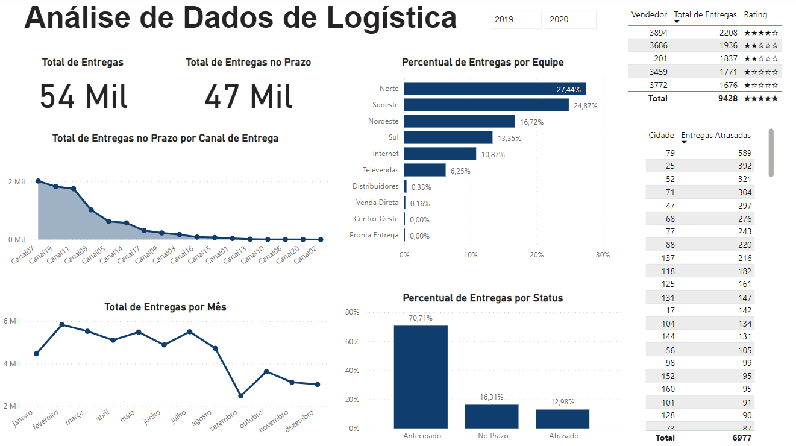
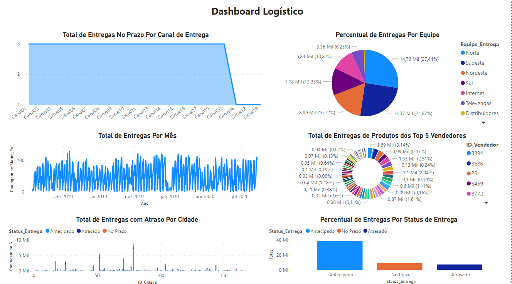

# Dashboard Logístico
 

  
   
  Dashboard de Logística após reconstrução e correção de erros

 

## Sobre o projeto
A partir do dashboard do setor de logística de uma empresa, que estava ruim e com erros, foi realizada uma reconstrução para corrigir os erros e melhorar a apresentação dos dados. O objetivo desse painel é a compreensão do processo de entrega dos produtos aos seus clientes e deveria conter os seguintes KPI's>

* Total de Entregas no Prazo Por Canal de Entrega
* Percentual de Entregas Antecipadas Por Equipede Entrega
* Total de Entregas Por Mês
* Total de Entregas de Produtos dos Top 5 Vendedores
* Total de Entregas com Atraso Por Cidade
* Percentual de Entregas Por Status de Entrega
 

* **[Projeto na íntegra (disponível para download)](https://github.com/raffaloffredo/dashboard_logistica/blob/main/dashboard_logistica.pbix)**
 

  
   
  Dashboard de Logística Antes

 

## Material Extra
Os dados utilizados nesse projeto referem-se à uma empresa fictícia e também estão disponíveis para download.

* **[Dataset Logística](https://github.com/raffaloffredo/dashboard_logistica/blob/main/dataset_logistica.xlsx)**
 

## Outros projetos

* **[Dashboard de Recursos Humanos](https://github.com/raffaloffredo/dashboard_rh)**
* **[Dashboard de Marketing](https://github.com/raffaloffredo/dashboard_marketing)**
* **[Dashboard de Vendas](https://github.com/raffaloffredo/dashboard_vendas)**
* **[Dashboard de Vendas Globais](https://github.com/raffaloffredo/dashboard_vendas_globais/)**
* **[Airbnb New York](https://github.com/raffaloffredo/airbnb_new_york_portuguese)**
* **[Estudo atualizado sobre COVID-19 no Brasil e no mundo](https://github.com/raffaloffredo/covid_2023_portuguese)**
* **[Detecção de fraude em cartão de crédito](https://github.com/raffaloffredo/fraud_detection_portuguese)**
 

 ## Contatos

  
  
  
  
  

